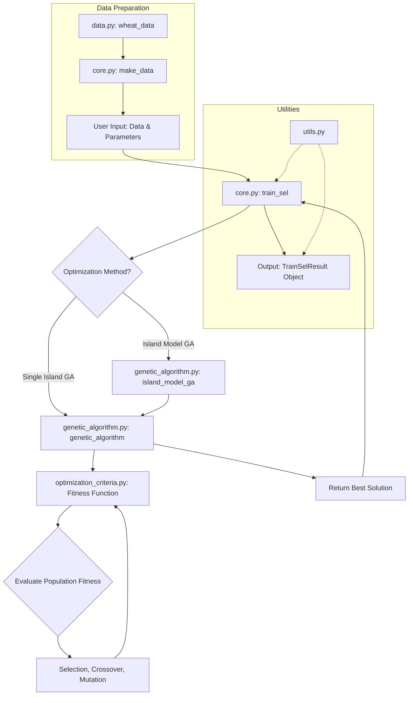

# TrainSelPy: A Detailed Codebase Blueprint

This document provides a comprehensive blueprint of the TrainSelPy codebase. It is intended to be a complete guide for understanding, reproducing, and extending the library.

## 1. Overall Architecture

TrainSelPy is designed as a modular library for optimizing the selection of training populations, primarily for genomic selection. The architecture is centered around a core module that orchestrates the optimization process, a genetic algorithm module that provides the optimization engine, and a set of pluggable optimization criteria.

### Core Modules

- **`core.py`**: This is the main entry point of the library. It contains the `train_sel` function, which orchestrates the entire optimization process. It also provides functions for creating the necessary data structures (`make_data`) and setting the control parameters (`train_sel_control`).

- **`genetic_algorithm.py`**: This module contains the implementation of the genetic algorithm (GA), which is the primary optimization engine. It includes the logic for population initialization, fitness evaluation, selection, crossover, and mutation. It also implements an island model for parallel processing and simulated annealing for fine-tuning solutions.

- **`optimization_criteria.py`**: This module provides a set of built-in fitness functions, known as optimization criteria. These include standard criteria used in genomic selection, such as `cdmean_opt` (Coefficient of Determination Mean), `dopt` (D-optimality), and `pev_opt` (Prediction Error Variance). Users can also provide their own custom fitness functions.

- **`data.py`**: This module is responsible for loading the example datasets, such as the wheat dataset. It provides a simple way for users to get started with the library and test its functionality.

- **`utils.py`**: This module contains a collection of utility functions that are used throughout the library. These include functions for converting R data to Python format, calculating relationship and distance matrices, and plotting the results of the optimization.

### Workflow Diagram

The following diagram illustrates the typical workflow of the TrainSelPy library:



## 2. Module Details

This section provides a detailed breakdown of each module in the TrainSelPy library.

### 2.1 `core.py`

This module serves as the main entry point for the library and orchestrates the optimization process.

#### Functions

**`make_data(...)`**

- **Description**: Creates the main data structure used by the `train_sel` function. It takes various matrices as input (e.g., features, relationship matrices) and prepares them for the optimization process.
- **Parameters**:
    - `M`: `np.ndarray`, optional - Features matrix.
    - `K`: `np.ndarray`, optional - Relationship matrix.
    - `R`: `np.ndarray`, optional - Residual relationship matrix.
    - `Vk`: `np.ndarray`, optional - Relationship matrix for blocks.
    - `Ve`: `np.ndarray`, optional - Relationship matrix for errors of blocks.
    - `lambda_val`: `float`, optional - Ratio of Ve to Vk.
    - `X`: `np.ndarray`, optional - Design matrix.
- **Returns**: `Dict[str, Any]` - A dictionary containing the prepared data, including the relationship matrices `G` and `R`.

**`train_sel_control(...)`**

- **Description**: Creates a control object that specifies the parameters for the genetic algorithm. This allows users to customize the optimization process.
- **Parameters**:
    - `size`: `str` - The size of the problem (e.g., "free").
    - `niterations`: `int` - The maximum number of iterations.
    - `npop`: `int` - The population size.
    - `mutprob`: `float` - The mutation probability.
    - `crossprob`: `float` - The crossover probability.
    - `nislands`: `int` - The number of islands for the island model.
    - `...` (and other GA parameters)
- **Returns**: `Dict[str, Any]` - A dictionary containing the control parameters.

**`set_control_default(...)`**

- **Description**: A convenience function that returns a control object with default parameters.
- **Parameters**:
    - `size`: `str` - The size of the problem.
- **Returns**: `Dict[str, Any]` - A control object with default settings.

**`train_sel(...)`**

- **Description**: The main function of the library. It runs the genetic algorithm to find the optimal training population.
- **Parameters**:
    - `data`: `Dict[str, Any]` - The data structure created by `make_data`.
    - `candidates`: `List[List[int]]` - A list of candidate sets to select from.
    - `setsizes`: `List[int]` - The sizes of the sets to select.
    - `settypes`: `List[str]` - The types of sets to select (e.g., "UOS", "OS").
    - `stat`: `Callable` - The fitness function. If `None`, `cdmean_opt` is used.
    - `control`: `Dict[str, Any]` - The control object.
    - `...` (and other parameters)
- **Returns**: `TrainSelResult` - A data class containing the results of the optimization, including the selected indices, fitness value, and execution time.

#### Classes

**`TrainSelResult`**

- **Description**: A `dataclass` that holds the results of the optimization.
- **Attributes**:
    - `selected_indices`: `List[List[int]]` - The selected indices for each set.
    - `selected_values`: `List[Any]` - The selected values for each set (for continuous variables).
    - `fitness`: `float` - The final fitness value of the best solution.
    - `fitness_history`: `List[float]` - A history of the best fitness value at each generation.
    - `execution_time`: `float` - The total execution time of the optimization.
    - `pareto_front`: `Optional[List[List[float]]]` - The Pareto front for multi-objective optimization.
    - `pareto_solutions`: `Optional[List[Dict[str, Any]]]` - The solutions on the Pareto front.

### 2.2 `genetic_algorithm.py`

This module implements the genetic algorithm and its components.

#### Classes

**`Solution`**

- **Description**: Represents a single solution in the population.
- **Attributes**:
    - `int_values`: `List[List[int]]` - The integer-based parts of the solution (e.g., selected indices).
    - `dbl_values`: `List[List[float]]` - The float-based parts of the solution (e.g., continuous variables).
    - `fitness`: `float` - The fitness value of the solution.
    - `multi_fitness`: `List[float]` - The fitness values for each objective in multi-objective optimization.

#### Functions

**`initialize_population(...)`**

- **Description**: Creates the initial population of random solutions.
- **Parameters**: `candidates`, `setsizes`, `settypes`, `pop_size`.
- **Returns**: `List[Solution]` - A list of randomly generated solutions.

**`evaluate_fitness(...)`**

- **Description**: Calculates the fitness of each solution in the population using the provided fitness function.
- **Parameters**: `population`, `stat_func`, `data`, `n_stat`, `is_parallel`, `control`.

**`selection(...)`**

- **Description**: Selects the parents for the next generation using tournament selection. For multi-objective optimization, it uses non-dominated sorting.
- **Parameters**: `population`, `n_elite`, `tournament_size`.
- **Returns**: `List[Solution]` - A list of selected parent solutions.

**`crossover(...)`**

- **Description**: Performs crossover on the parent solutions to create offspring.
- **Parameters**: `parents`, `crossprob`, `crossintensity`, `settypes`, `candidates`.
- **Returns**: `List[Solution]` - A list of offspring solutions.

**`mutation(...)`**

- **Description**: Applies mutation to the solutions in the population to introduce diversity.
- **Parameters**: `population`, `candidates`, `settypes`, `mutprob`, `mutintensity`.

**`simulated_annealing(...)`**

- **Description**: Performs simulated annealing on a solution to fine-tune it.
- **Parameters**: `solution`, `candidates`, `settypes`, `stat_func`, `data`, `n_stat`, `n_iter`, `temp_init`, `temp_final`.
- **Returns**: `Solution` - The optimized solution.

**`genetic_algorithm(...)`**

- **Description**: The main genetic algorithm loop. It orchestrates the entire evolutionary process.
- **Parameters**: `data`, `candidates`, `setsizes`, `settypes`, `stat_func`, `control`, `...`.
- **Returns**: `Dict[str, Any]` - A dictionary containing the results of the optimization.

**`island_model_ga(...)`**

- **Description**: Implements the island model for parallel genetic algorithms. It runs multiple populations in parallel and migrates solutions between them.
- **Parameters**: `data`, `candidates`, `setsizes`, `settypes`, `stat_func`, `n_islands`, `n_jobs`, `...`.
- **Returns**: `Dict[str, Any]` - A dictionary containing the consolidated results from all islands.

### 2.3 `optimization_criteria.py`

This module provides a collection of built-in fitness functions for common optimization criteria in genomic selection.

#### Functions

**`dopt(soln, data)`**

- **Description**: Calculates the D-optimality criterion, which aims to maximize the determinant of the information matrix.
- **Returns**: `float` - The log determinant of the cross-product of the selected features.

**`maximin_opt(soln, data)`**

- **Description**: Calculates the maximin criterion, which seeks to maximize the minimum distance between any pair of selected samples.
- **Returns**: `float` - The minimum distance between selected samples.

**`pev_opt(soln, data)`**

- **Description**: Calculates the Prediction Error Variance (PEV) criterion, which aims to minimize the average prediction error variance for a set of target individuals.
- **Returns**: `float` - The mean prediction error variance.

**`cdmean_opt(soln, data)`**

- **Description**: Calculates the Coefficient of Determination Mean (CDMean) criterion, a commonly used criterion for optimizing genomic selection.
- **Returns**: `float` - The CDMean value.

**`cdmean_opt_target(soln, data)`**

- **Description**: A variation of the CDMean criterion that focuses on a specific set of target individuals.
- **Returns**: `float` - The CDMean value for the target samples.

**`fun_opt_prop(soln_int, soln_dbl, data)`**

- **Description**: An example of a multi-objective fitness function that optimizes for both breeding value and inbreeding.
- **Returns**: `List[float]` - A list containing the breeding value and the negative inbreeding value.

### 2.4 `data.py`

This module provides the example wheat dataset.

#### Functions

**`load_wheat_data()`**

- **Description**: Loads the wheat dataset from a pickle file if it exists. If not, it simulates the data and saves it for future use.
- **Returns**: `Dict[str, Any]` - A dictionary containing the wheat data (`Y`, `M`, `K`).

### 2.5 `utils.py`

This module provides various utility functions.

#### Functions

**`r_data_to_python(...)`**

- **Description**: Converts R data files (`.rda`, `.rdata`) to Python format using the `rpy2` library.
- **Returns**: `Dict[str, Any]` - A dictionary containing the converted data.

**`create_distance_matrix(...)`**

- **Description**: Creates a distance matrix from a feature matrix.
- **Returns**: `np.ndarray` - The distance matrix.

**`calculate_relationship_matrix(...)`**

- **Description**: Calculates a relationship matrix from a marker matrix.
- **Returns**: `np.ndarray` - The relationship matrix.

**`create_mixed_model_data(...)`**

- **Description**: A convenience function for creating the data structure for mixed model optimization.
- **Returns**: `Dict[str, Any]` - The prepared data dictionary.

**`plot_optimization_progress(...)`**

- **Description**: Plots the fitness history of the optimization process.

**`plot_pareto_front(...)`**

- **Description**: Plots the Pareto front for multi-objective optimization.

## 3. Data Structures

This section describes the key data structures used within the TrainSelPy library.

### 3.1 `TrainSel_Data` Dictionary

This is the primary data structure that holds all the necessary information for the optimization process. It is a standard Python dictionary with the following keys:

- **`G`**: `np.ndarray` - The genomic relationship matrix.
- **`R`**: `np.ndarray` - The residual relationship matrix.
- **`lambda`**: `float` - The ratio of residual to genetic variance.
- **`labels`**: `pd.DataFrame` - A DataFrame containing the labels for the individuals.
- **`Nind`**: `int` - The total number of individuals.
- **`class`**: `str` - Set to "TrainSel_Data" to identify the data structure.
- **`X`**: `np.ndarray`, optional - The design matrix.
- **`FeatureMat`**: `np.ndarray`, optional - A matrix of features for each individual (used for D-optimality).
- **`DistMat`**: `np.ndarray`, optional - A matrix of distances between individuals (used for maximin optimization).
- **`Target`**: `List[int]`, optional - A list of indices for the target individuals.

### 3.2 `Solution` Class

This class represents a single solution within the genetic algorithm's population.

- **`int_values`**: `List[List[int]]` - A list of lists, where each inner list represents a set of selected indices for a discrete variable.
- **`dbl_values`**: `List[List[float]]` - A list of lists, where each inner list represents a set of values for a continuous variable.
- **`fitness`**: `float` - The fitness score of the solution. For multi-objective optimization, this is typically the sum of the individual objective scores.
- **`multi_fitness`**: `List[float]` - A list of fitness scores, one for each objective in a multi-objective optimization problem.

## 4. Reproducing the Codebase

This section provides a step-by-step guide to reproduce the TrainSelPy environment and run the examples.

### 4.1 Prerequisites

- Python 3.7+
- `pip` and `venv`

### 4.2 Setup and Installation

1. **Clone the repository:**
   ```bash
   git clone https://github.com/yourusername/trainselpy.git
   cd trainselpy
   ```

2. **Create and activate a virtual environment:**
   ```bash
   python -m venv venv
   source venv/bin/activate  # On Windows, use `venv\Scripts\activate`
   ```

3. **Install the required dependencies:**
   ```bash
   pip install -r requirements.txt
   ```
   *(Note: A `requirements.txt` file may need to be created if one does not already exist. Based on the `README.md`, it should contain `numpy`, `scipy`, `pandas`, `scikit-learn`, `matplotlib`, and `joblib`.)*

4. **Install the package in editable mode:**
   ```bash
   pip install -e .
   ```

### 4.3 Running the Examples

The `examples` directory contains Jupyter notebooks that demonstrate the usage of the library.

1. **Install Jupyter:**
   ```bash
   pip install jupyter
   ```

2. **Run Jupyter Notebook:**
   ```bash
   jupyter notebook
   ```

3. **Open and run the notebooks in the `examples` directory to see the library in action.**

### 4.4 Running the Tests

The `tests` directory contains the unit tests for the library.

1. **Install pytest:**
   ```bash
   pip install pytest
   ```

2. **Run the tests:**
   ```bash
   pytest
   ```
